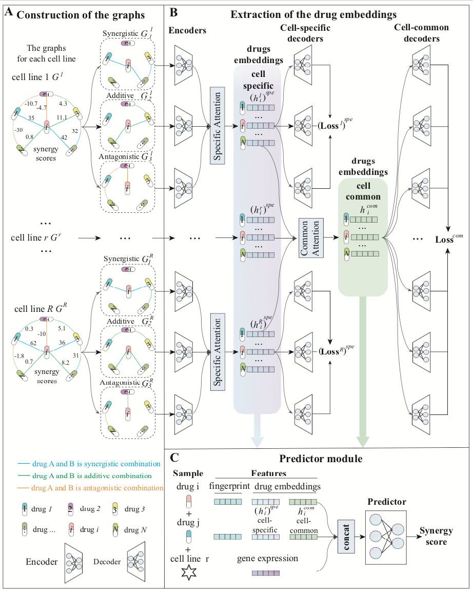

# MGAE-DC
This is the implementation code of MGAE-DC, a deep learning framework for predicting the synergistic effects of drug combinations through multi-channel graph autoencoders.



## Requirements
Python 3.8 or higher  
pandas 1.3.5
numpy 1.21.2
tensorflow 2.4.1    


## Datasets
1. O'Neil dataset
2. ALMANAC dataset
3. CLOUD datset
4. FORCINA datset


## Training
###The embedding module
python codes/get_oneil_mgaedc_representation.py -learning_rate 0.001 -epochs 10000 -embedding_dim 320 -drop_out 0.2 -weight_decay 0 -val_test_size 0.1  
This script is used to extract the cell line-specific and common drug embeddings through multi-channel graph autoencoders in the embedding module. 


|Argument|Default|Description|
|---|---|----|
| learning_rate|  0.001|  Initial learning rate. |
| epochs|  10000|  The number of training epochs. |
| embedding_dim|  320|  The number of dimension for drug embeddings. |
| dropout|  0.2|  Dropout rate (1 - keep probability) |
| weight_decay|  0|  Weight for L2 loss on embedding matrix. |
| val_test_size|  0.1|  the rate of validation and test samples. |


###The predictor module
python codes/get_oneil_mgaedc.py -learning_rate 0.01 -epochs 500 -batch 320 -drop_out 0.2 -hidden 8192 -patience 100 
This script is used to predict the synergistic effects of drug combinations in the predictore module.

|Argument|Default|Description|
|---|---|----|
| learning_rate|  0.01|  Initial learning rate. |
| epochs|  500|  The number of training epochs. |
| batch|  256|  The nbatch size. |
| hidden|  0.2|  Dropout rate (1 - keep probability) |
| weight_decay|  1024|  (n, n/2, 1) The hidden size for NN. |
| patience|  100|  the patience for early stop. |


## Reference
Please cite our work if you find our code/paper is useful to your work.

```   
@article{Zhang, 
title={MGAE-DC: predicting the synergistic effects of drug combinations through multi-channel graph autoencoders}, 
author={Peng Zhang, Shikui Tu}, 
journal={}, 
volume={}, 
number={}, 
year={2022}, 
month={}, 
pages={} 
}
```
